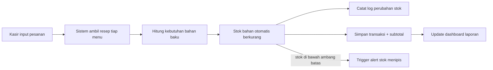
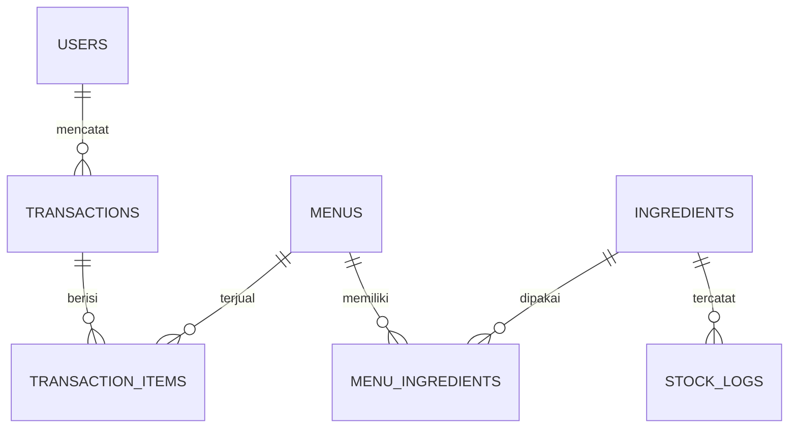

<p align="center">
  
  
  
  
</p>

<h1 align="center">🍜 WarungStock</h1>
<p align="center"><b>Inventory & Sales Management System for F&B</b></p>
<p align="center">Sistem manajemen stok bahan baku & penjualan untuk UMKM kuliner — stok berkurang otomatis sesuai resep tiap kali ada transaksi.</p>

<p align="center">
  <a href="#-fitur">Fitur</a> •
  <a href="#-alur-sistem">Alur Sistem</a> •
  <a href="#-tech-stack">Tech Stack</a> •
  <a href="#-roadmap">Roadmap</a>
</p>

---

## 📌 Latar Belakang

UMKM kuliner skala kecil-menengah umumnya mencatat stok bahan baku secara manual, sehingga rawan selisih stok, telat restock, dan tidak tahu menu mana yang marginnya paling tipis. Insight ini muncul dari pengamatan langsung di industri Food and Beverage (FnB), di mana pencatatan stok dan transaksi biasanya berjalan terpisah.

**WarungStock** menghubungkan resep tiap menu langsung ke data bahan baku, sehingga setiap transaksi otomatis memperbarui stok dan menghitung margin secara real-time.

## ✨ Fitur

### Fase 1 — MVP
- 🔐 Autentikasi multi-role (Admin/Owner, Kasir)
- 🥬 CRUD bahan baku (nama, satuan, stok, harga beli per satuan)
- 🍽️ CRUD menu + resep (relasi menu ↔ bahan baku beserta takaran)
- 🧾 Transaksi penjualan — stok otomatis berkurang sesuai resep
- 📜 Riwayat transaksi harian

### Fase 2 — Pelaporan
- ⚠️ Alert stok menipis (di bawah ambang batas minimum)
- 📊 Laporan penjualan harian/mingguan
- 📈 Dashboard visual (grafik penjualan, menu terlaris, margin per menu)

### Fase 3 — AI Integration
- 🤖 Tanya-jawab berbasis data (natural language query ke laporan) via LLM API

## 🔄 Alur Sistem

**Alur transaksi (inti sistem):**



**Alur relasi data:**



Logika inti (pengurangan stok otomatis) diimplementasikan di `app/Services/TransactionService.php`, dibungkus dalam satu DB transaction agar konsisten — kalau ada error di tengah proses, semua perubahan (stok, log, transaksi) otomatis dibatalkan bersamaan.

## 🧩 Detail Fitur & Task Teknis

<details>
<summary><b>Fase 1 — MVP</b></summary>

| Fitur | Task Teknis |
|---|---|
| Autentikasi & Role | Migration kolom `role`, middleware pembeda akses Admin/Kasir, session guard |
| CRUD Bahan Baku | Livewire component + form validation, table listing dengan search/filter |
| CRUD Menu & Resep | Relasi many-to-many `menus` ↔ `ingredients` via tabel pivot `menu_ingredients` |
| Transaksi Penjualan | `TransactionService` — DB transaction untuk simpan transaksi + auto-decrement stok |
| Riwayat Transaksi | Query dengan eager loading (`with()`) untuk hindari N+1 problem |

</details>

<details>
<summary><b>Fase 2 — Pelaporan</b></summary>

| Fitur | Task Teknis |
|---|---|
| Alert Stok Menipis | Accessor `isLowStock()` di model `Ingredient`, badge notifikasi di dashboard |
| Laporan Penjualan | Query aggregate (`sum`, `groupBy` per tanggal) |
| Dashboard Visual | Integrasi Chart.js, data di-serve via Livewire computed property |

</details>

<details>
<summary><b>Fase 3 — AI Integration</b></summary>

| Fitur | Task Teknis |
|---|---|
| Query Bahasa Natural | Endpoint API khusus, kirim konteks data ke LLM API, parsing response jadi jawaban |

</details>

## 🛠️ Tech Stack

| Layer | Teknologi |
|---|---|
| Backend | Laravel 12 + Livewire 3 |
| Database | PostgreSQL |
| Frontend | Blade + Bootstrap |
| Formatting | Laravel Pint (PSR-12) |
| Deployment | Railway |
| AI (Fase 3) | LLM API (OpenAI/Claude) |

## 🧰 Tools Pendukung

| Kategori | Tools |
|---|---|
| Code Editor | VS Code |
| Database Client | pgAdmin / TablePlus |
| API Testing | Postman |
| Version Control | Git + GitHub |
| Local Server | Laravel Artisan Serve |
| Package Manager | Composer, NPM |

## 🗄️ Struktur Database

```
users              (id, name, email, password, role)
ingredients        (id, name, unit, stock_qty, cost_per_unit, min_stock_alert)
menus              (id, name, price, category, is_active)
menu_ingredients   (id, menu_id, ingredient_id, qty_needed)   -- relasi resep
transactions       (id, user_id, total_amount)
transaction_items  (id, transaction_id, menu_id, qty, subtotal)
stock_logs         (id, ingredient_id, change_qty, reason)    -- audit trail
```


## 🗺️ Roadmap

- [x] Setup project & skema database
- [ ] Autentikasi & role management
- [ ] CRUD bahan baku & menu
- [ ] Transaksi + auto-kurangi stok
- [ ] Dashboard & laporan
- [ ] Integrasi AI query (Fase 3)
- [ ] Deploy production

## 📄 Dokumentasi Lengkap

- [Studi Kasus](./docs/STUDI_KASUS.md)
- [Rencana Pengembangan Mingguan](./docs/RENCANA_MINGGUAN.md)

<p align="center"><i>Dikembangkan bertahap di luar jam kerja, jangan lupa titik koma ya ; Semangat Pejuang :) </i></p>
